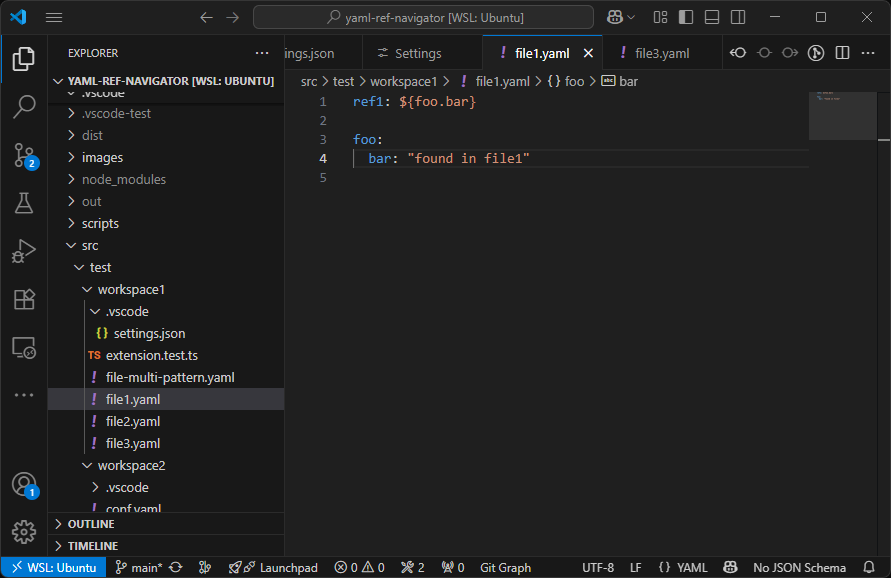
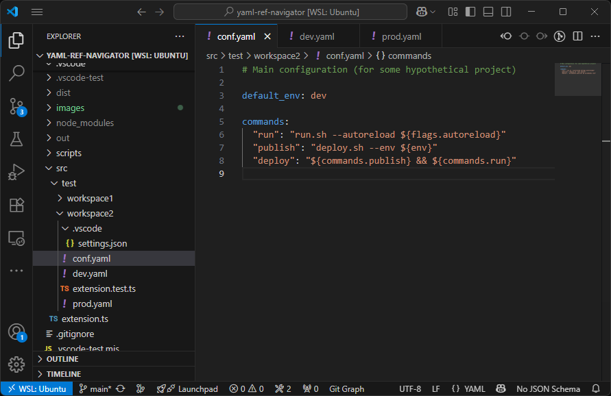

# YAML Ref Navigator

Enable jump-to-definition within YAML for references of style `${foo.bar}`.
This enables `Ctrl + Left Click`, `F12` or whatever other shortcut you have.

## Features

- Supports nested keys like `${foo.bar.baz}`
- Works across multiple YAML files in your workspace or open editors
- Support custom regexes for defining patterns (see settings below).

**WARNING**: Developed using generative coding tools by an experienced developer who is trying TypeScript for the first time.
There are some tests, and nothing is ever modified, so the risk should be minimal; it might just not work.

## Usage

1. Install the extension
2. Open a `.yaml` or `.yml` file
3. Ctrl+Click or F12 (or whatever shortcut you have for 'Jump to Definition') on a `${foo.bar}` reference

If the reference is not found, you will get a warning.

In case of multiple documents, it will find all valid definitions:

## Requirements

No external requirements besides [`eemeli/yaml` package](https://eemeli.org/yaml/#yaml) (should auto-install).

We strongly support installing the
[YAML Language Support by Red Hat](https://marketplace.visualstudio.com/items?itemName=redhat.vscode-yaml)
extension, which uses `yaml-language-server`.

## Extension Settings

- `yamlRefNavigator.yamlVersion` : The default YAML document version. '1.2' is recommended and default.
- `yamlRefNavigator.fileExtensions` : The file extensions to consider as YAML documents, e.g. `[".yaml", ".yml"]`
- `yamlRefNavigator.referencePatterns` : A list of regular expression patterns
  that we will parse as a YAML reference pattern. These expressions must have exactly one capture group
  and not be anchored. The default is `"\\$\\{([a-zA-Z0-9_\\-.]+)\\}"` such as `${foo.bar-baz.MyName9}`.
  It is not particuarly robust, so you may have some false positives.
- `yamlRefNavigator.debug` : Whether to give debugging popups when resolving keys.

## Known Issues

- Probably terrible performance in large repos, as all YAML files keep getting parsed.
- Only mappings are supported as references, with a dot syntax.
- Not super robust in terms of regexes (e.g. `${.foo.bar}` could be a local reference, but currently not).
- Only references to YAML files are supported.

## Release Notes

See the [changelog](./CHANGELOG.md) for more details.

### 0.2.3

Fixed searching in unopened files. Added configuration options for file types.

### 0.2.2

Better example documentation, including animated example.

### 0.2.1

Update readmes, warnings etc. and re-publish.

### 0.2.0

Add configuration options debug, referencePatterns, yamlVersion.

### 0.1.0

Initial version.

---
